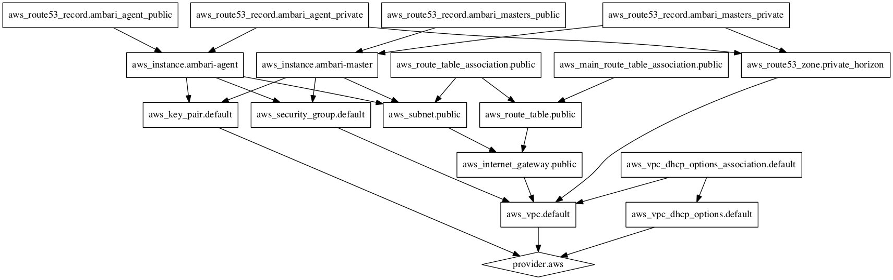

# **Ambari-hub**
Ambari templates, docker, packer, terraform etc.

It's more of a backup then anything else, you can use it I guess. And if you want to commit to it, be my guest ;-)

# **Basic Info**

Rename the variables.tf.example (obviously) and fill in the variables.
The public zone inside route53 needs to be there upfront, simply because of the latency DNS has when adding a new zone (it takes a while before everything is updated, as in couple of hours).

Also the security group might have to be changed manually, since this is just for testing it has erm....*ahum* really bad security...(as in none) it's open to the world...which you obviously DON'T want!

# **Terraform Graph**

# **TODO**

1. The plan needs to be split into several modules.
2. Extend AWS support to also allow for private VPC (eg. don't expose anything public).
3. Add other cloudsupport (eg. Cloudstack).
4. Add basic blueprint, maybe just export a handmade cluster.